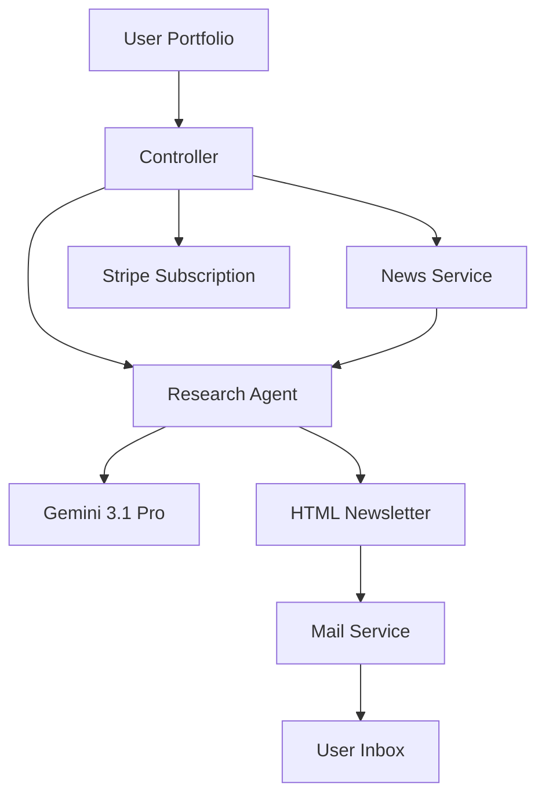

# 🚀 Stock Monitoring Agent

> [!TIP]
> This agent follows a **Fetch → Filter → Synthesize → Deliver** pipeline.

# 🚀 Orbit AI  
### Personalized AI-Powered Stock Intelligence Engine


Orbit AI is a modular backend system that delivers **signal-to-noise investment intelligence** using AI.

It mirrors the logic of high-end institutional research services by:

- Fetching real-time market data  
- Filtering noise using LLM reasoning  
- Generating personalized portfolio reports  
- Delivering premium email insights  
- Monetizing via subscription  

---

# 🧠 System Overview

Orbit AI follows a **Controller → Service → Agent** architecture.

This ensures:

- Clean separation of logic  
- Scalable AI layer  
- Replaceable data providers  
- Easy monetization integration  
- Production-ready modularity  

---

# 🏗 Architecture Diagram



---

# 📂 Project Structure

```plaintext
stock-agent-backend/
├── src/
│   ├── agents/
│   │   └── researchAgent.js
│   ├── services/
│   │   ├── newsService.js
│   │   └── mailService.js
│   ├── routes/
│   │   └── subscription.js
│   ├── templates/
│   │   └── newsletter.html
│   └── app.js
├── .env
├── package.json
└── README.md
```

---

# 🧠 1. The Brain — AI Reasoning Layer

**File:** `src/agents/researchAgent.js`

Uses Gemini 3.1 Pro to transform raw market data into personalized research.

```javascript
import { GoogleGenerativeAI } from "@google/generative-ai";

const genAI = new GoogleGenerativeAI(process.env.GEMINI_API_KEY);

export const generatePersonalizedReport = async (userData, rawNews) => {
  const model = genAI.getGenerativeModel({ model: "gemini-3.1-pro" });

  const prompt = `
    You are a private equity analyst.
    User Portfolio: ${userData.watchlist.join(", ")}
    Raw Data: ${JSON.stringify(rawNews)}

    Task:
    1. Remove general market noise.
    2. Focus ONLY on events impacting the user's holdings.
    3. Generate clean HTML formatted for an email newsletter.
    4. Include a "Key Takeaway" section per ticker.
  `;

  const result = await model.generateContent(prompt);
  return result.response.text();
};
```

---

# 👁 2. The Senses — Market Data Layer

**File:** `src/services/newsService.js`

Fetches earnings, news, and relevant ticker updates.

```javascript
import axios from 'axios';

export const getMarketData = async (tickers) => {
  const API_KEY = process.env.MARKET_DATA_KEY;

  const newsPromises = tickers.map(ticker =>
    axios.get(`https://api.marketdata.com/v1/news/${ticker}?apikey=${API_KEY}`)
  );

  const results = await Promise.all(newsPromises);
  return results.map(res => res.data);
};
```

Supports integration with:

- Polygon.io  
- AlphaVantage  
- Finnhub  
- Bloomberg (enterprise)  

---

# 🎛 3. The Orchestrator — Execution Engine

**File:** `src/app.js`

Controls workflow:

1. Fetch data  
2. Generate AI insights  
3. Send email  

```javascript
import { getMarketData } from './services/newsService.js';
import { generatePersonalizedReport } from './agents/researchAgent.js';
import { sendEmail } from './services/mailService.js';

const runDailyAgent = async (user) => {
  try {
    console.log(`Starting run for ${user.email}...`);

    const rawData = await getMarketData(user.watchlist);
    const formattedNewsletter = await generatePersonalizedReport(user, rawData);

    await sendEmail(
      user.email,
      "Your Daily Decoded Insights",
      formattedNewsletter
    );

    console.log("Newsletter sent successfully!");
  } catch (error) {
    console.error("Agent failed:", error);
  }
};
```

---

# 💳 Monetization Layer — Stripe Integration

Orbit AI uses subscription billing:

- $1 intro trial (30 days)  
- Auto-transition to $5/month recurring  
- Managed via Stripe Checkout session  

Configure in Stripe:

- Product type: Subscription  
- Trial period: 30 days  
- Trial price: $1  
- Recurring price: $5/month  

Stripe automatically handles tier transition.

---

# ✉ Email Delivery Layer

Uses:

- Resend API  
- Custom HTML template  
- Mobile-responsive design  
- Institutional-style formatting  

---

# 🔐 Environment Variables

Create `.env`:

```plaintext
GEMINI_API_KEY=your_google_key
MARKET_DATA_KEY=your_market_api_key
RESEND_API_KEY=your_email_key
STRIPE_SECRET_KEY=your_stripe_key
```

⚠️ Never commit `.env` to GitHub.

---

# ⚙ Installation

## 1️⃣ Clone Repository

```bash
git clone https://github.com/lillianlau0101/orbit.ai.git
cd orbit.ai
```

## 2️⃣ Install Dependencies

```bash
npm install @google/generative-ai axios express dotenv resend stripe
```

## 3️⃣ Run Locally

```bash
node src/app.js
```

---

# 🔄 Deployment Options

- Vercel  
- Railway  
- Render  
- AWS Lambda  
- DigitalOcean  

---

# 📈 Roadmap

- User authentication (JWT)  
- PostgreSQL portfolio storage  
- Dashboard analytics  
- Risk scoring model  
- Portfolio performance tracking  
- AI-driven trade alerts  
- Usage-based billing  
- Multi-agent architecture  

---

# 🎯 Vision

Orbit AI is not just a newsletter generator.

It is a:

- Modular AI research engine  
- Portfolio-specific intelligence layer  
- Signal-to-noise financial filter  
- Subscription-based AI micro-fund infrastructure  

Designed to scale from:

Individual investors → Professional managers → Institutional clients.
